# Latent Tools for ComfyUI

A collection of nodes for manipulating latent tensors in ComfyUI. These tools provide various operations for working with latent representations in stable diffusion workflows.

Made in collaboration with [fzayguler](https://github.com/fzayguler)

## Installation

1. Clone this repository into your `ComfyUI/custom_nodes/` directory
2. Restart ComfyUI

Or use the ComfyUI extension manager.

## Available Nodes

### Preview and Debug

#### LTPreviewLatent
Visualizes latent tensors for debugging and inspection.

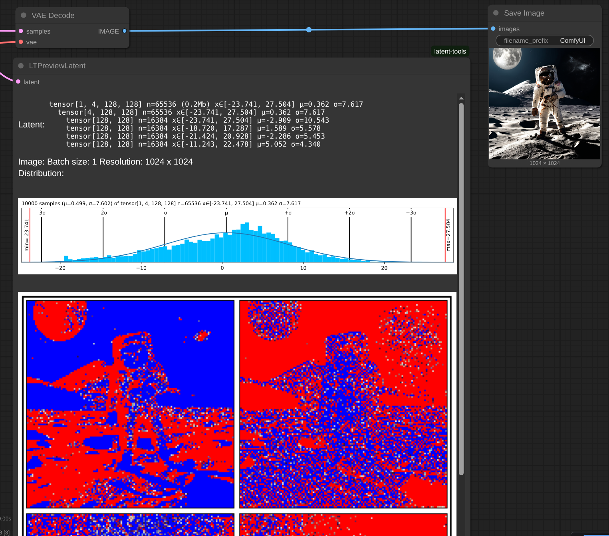

### KSampler with additional noise input

#### LTKSampler

A KSampler variant that accepts an additional input for starting latent space noise.

| 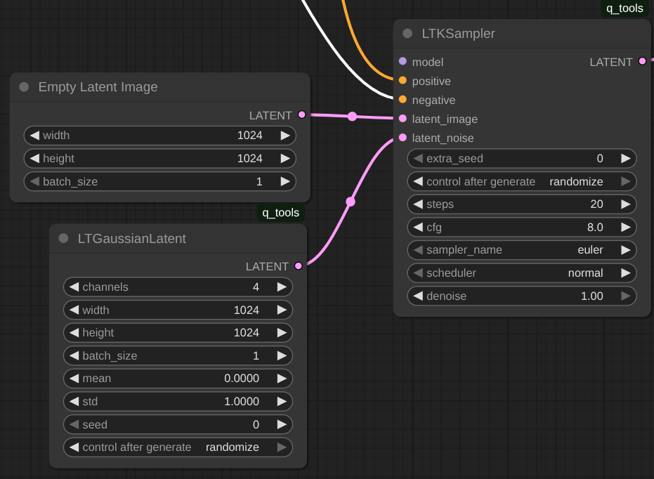 |
|------------|
| **Inputs** |
| - `model`: The model used for denoising |
| - `extra_seed`: See for any other noise used by the sampler |
| - `steps`: Number of steps in the denoising process |
| - `cfg`: Classifier-Free Guidance scale |
| - `sampler_name`: Algorithm used for sampling |
| - `scheduler`: Controls how noise is gradually removed |
| - `positive`: Positive conditioning |
| - `negative`: Negative conditioning |
| - `latent_image`: The latent image to denoise |
| - `latent_noise`: Starting noise for the sampler |
| - `denoise`: Amount of denoising to apply |
| **Outputs** |
| - `latent`: The denoised latent tensor |

#### LTGaussianLatent

Generates latent tensors filled with random values from a normal (Gaussian) distribution.

|  |
|------------|
| **Inputs** |
| - `channels`: Number of channels (default: 4) |
| - `width`: Width of the latent space (will be divided by 8) |
| - `height`: Height of the latent space (will be divided by 8) |
| - `batch_size`: Number of samples to generate |
| - `mean`: Mean of the normal distribution |
| - `std`: Standard deviation of the normal distribution |
| - `seed`: Random seed |
| **Outputs** |
| - `latent`: Generated latent tensor |
|  |

**Example:**

| "quick brown fox",  σ=0.9 μ=0 | "quick brown fox", σ=1.05, μ=0 | "quick brown fox", σ=1, μ=0 | "quick brown fox", σ=1, μ=-0.1 | "quick brown fox", σ=1, μ=0.1 |
|---|---|---|---|---|
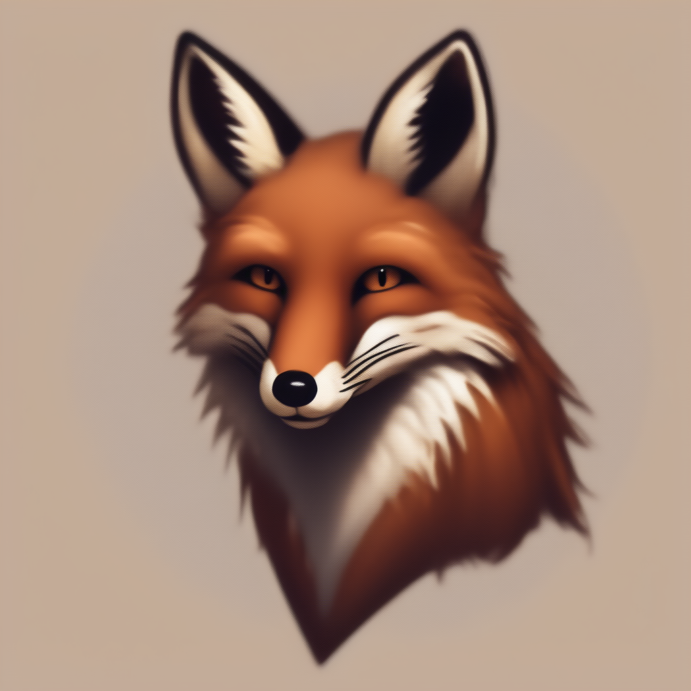 |  |  |  |  |

#### LTUniformLatent
Generates latent tensors with values uniformly distributed between min and max.

|  |
|------------|
| **Inputs** |
| - `channels`: Number of channels (default: 4) |
| - `width`: Width of the latent space (will be divided by 8) |
| - `height`: Height of the latent space (will be divided by 8) |
| - `batch_size`: Number of samples to generate |
| - `min`: Minimum value |
| - `max`: Maximum value |
| - `seed`: Random seed |
| **Outputs** |
| - `latent`: Generated latent tensor |
|  |

> Note: Stable Diffusion models are usually trained with Gaussian noise, so the generations from Uniform noise will look unusual.

**Example:**

| "quick brown fox", -1.67 to 1.67 | "quick brown fox", -1.81 to 1.81 |
|---|---|
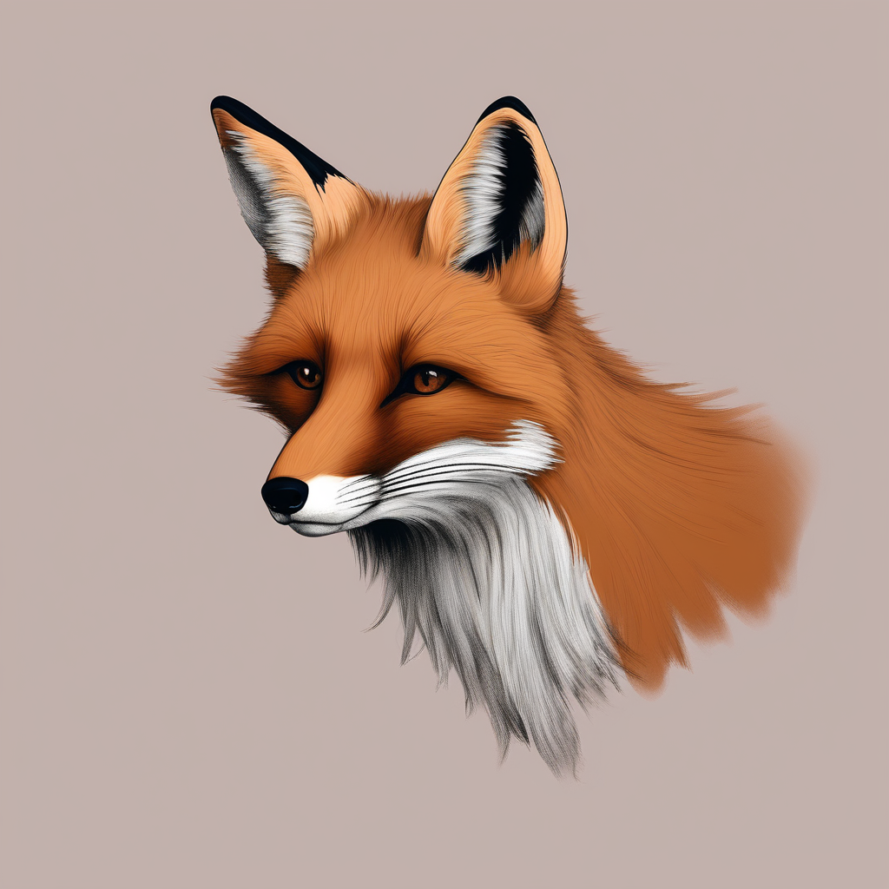 |  |

### Latent Operations

#### LTBlendLatent
Blends two latent tensors using various blending modes.

|  |
|------------|
| **Inputs** |
| - `latent1`: First latent tensor |
| - `latent2`: Second latent tensor |
| - `mode`: Blending mode |
| - `ratio`: Blend ratio (0.0 to 1.0) **Only used for mode=sample or mode=interpolate** |
| - `seed`: Random seed **Only used for mode=sample** |
| **Outputs** |
| - `latent`: Blended latent tensor |

| **Blending Modes** | **Description** |
|-------------------|-----------------|
| `interpolate`     | Linear interpolation between latents |
| `add`             | Additive blending |
| `multiply`        | Multiplicative blending |
| `abs_max`         | Maximum of absolute values |
| `abs_min`         | Minimum of absolute values |
| `max`             | Element-wise maximum |
| `min`             | Element-wise minimum |
| `sample`          | Randomly sample from either latent based on ratio |

Example:
Inputs: Random Gaussian σ=1 μ=0 (top) and Random Uniform [-1, 1] (bottom)
Blend modes: interpolate (top) and sample (bottom)

#### LTLatentOp
Applies mathematical operations to a latent tensor.

|  |
|------------|
| **Inputs** |
| - `latent`: Input latent tensor |
| - `op`: Operation to apply |
| - `arg`: Argument to apply (for operations that require an argument) |
| **Outputs** |
| - `latent`: Resulting latent tensor |

| **Operation** | **Description** |
|---------------|-----------------|
| `add`         | Add a value |
| `mul`         | Multiply by a value |
| `pow`         | Raise to a power |
| `exp`         | Exponential |
| `abs`         | Absolute value |
| `clamp_bottom` | Clamp minimum value |
| `clamp_top`   | Clamp maximum value |
| `norm`        | Normalize (zero mean, unit variance) |
| `mean`        | Set mean to specified value |
| `std`         | Set standard deviation to specified value |
| `sigmoid`     | Apply sigmoid function |
| `nop`         | No operation |

Example:
Inputs: Random Gaussian σ=1 μ=0
Op: abs

#### LTLatentsConcatenate
Concatenates two latent tensors along a specified dimension.

|   |
|------------|
| **Inputs** |
| - `latent1`: First latent tensor |
| - `latent2`: Second latent tensor |
| - `dim`: Dimension to concatenate along (supports negative indexing) |
| **Outputs** |
| - `latent`: Concatenated latent tensor |

Example1:
2 images, concatenated along x axis:

Example2:
Stable Video Diffusion xt (24 frames total), concatenating
- 10 frames Gaussian noise (σ=1 μ=0)
- 4  frames Gaussian noise (σ=1.2 μ=0)
- 10 frames Gaussian noise (σ=1 μ=0)

| 10f (σ=1 μ=0) + 4f (σ=1.2 μ=0) + 10f (σ=1 μ=0) | 24f (σ=1 μ=0) |
|---|---|
|  |  |

#### LTLatentToShape
Extracts the shape of a latent tensor.

| 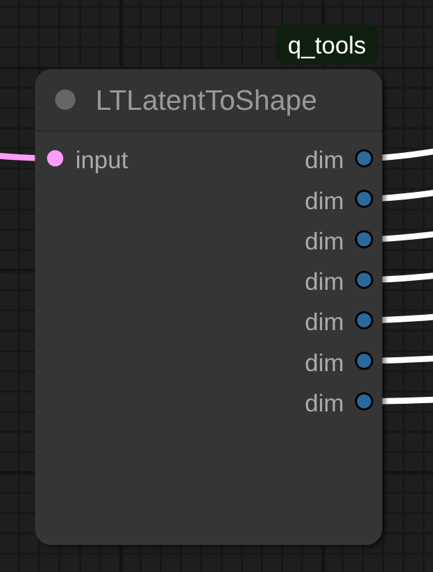 |
|------------|
| **Inputs** |
| - `input`: Input latent tensor |
| **Outputs:** |
| - Return 7 dimensions of the input latent shape. Non-existing ones are returned as 0 |

#### LTReshapeLatent
Reshapes a latent tensor to new dimensions.

| 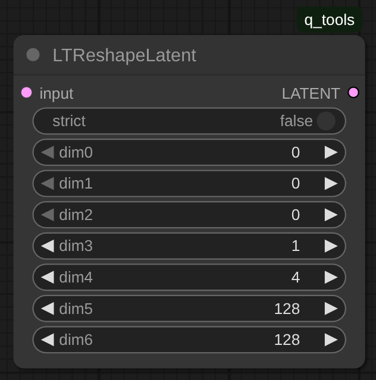 |
|------------|
| **Inputs** |
| - `input`: Input latent tensor |
| - `strict`: If True, requires exact size match |
| - `dim0`-`dim6`: Target dimensions (0 values are ignored) |
| **Outputs** |
| - `latent`: Reshaped latent tensor |

**Example:**
Reshape one latent to match another one:

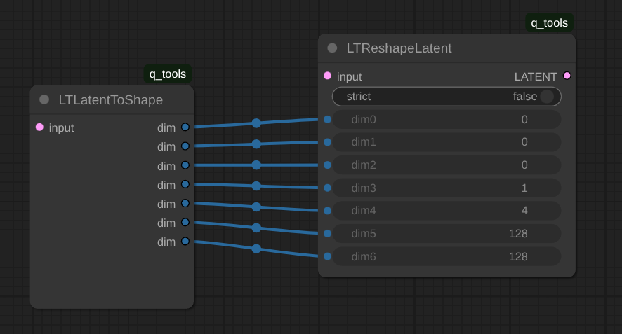
<!--  -->

## Batch helpers
### Parameter Randomization

LTNumberRangeUniform and LTRandomRangeGaussian are used to randomize inputs to other nodes when scheduling multiple images.

#### LTNumberRangeUniform
Generates random float values from a uniform distribution.

| 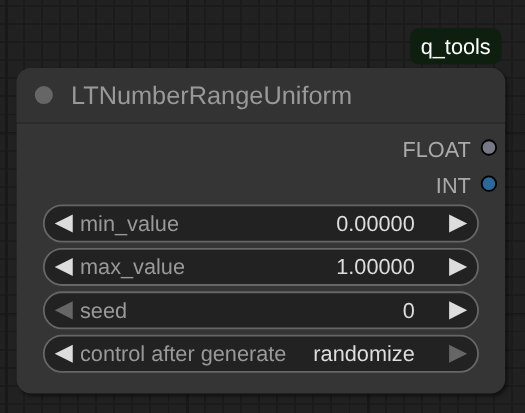 |
|------------|
| **Inputs** |
| - `min`: Minimum value |
| - `max`: Maximum value |
| - `seed`: Random seed - randomize it to get different values for each image |
| **Outputs** |
| - `float`: Generated number as float |
| - `int`: Generated number as int |

#### LTNumberRangeGaussian
Generates random values from a Gaussian distribution.

| 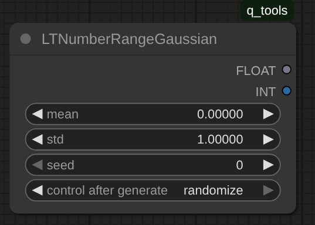 |
|------------|
| **Inputs** |
| - `mean`: Mean of the normal distribution |
| - `std`: Standard deviation of the normal distribution |
| - `seed`: Random seed - randomize it to get different values for each image |
| **Outputs** |
| - `float`: Generated number as float |
| - `int`: Generated number as int |

** Example: **

Let's randomize a bumch of parameters:
- For the Gaussian Noise that is used as input:
   - the mean value will be itself a random value between -0.2 and 0.2.
   - The standard deviation will be itself a random value with mean 1 and std 0.5, clipped to 0.1 at the low end (using the ComfyMath node).
- The number of diffusion steps is random uniform betwee 5 and 40.
- The  cfg is random gussian with mean 8 and std 1, clipped to 0.1 at the low end (using the ComfyMath node).

Using this setup, generate 100 images with different parameters.

| | |
|---|---|
| 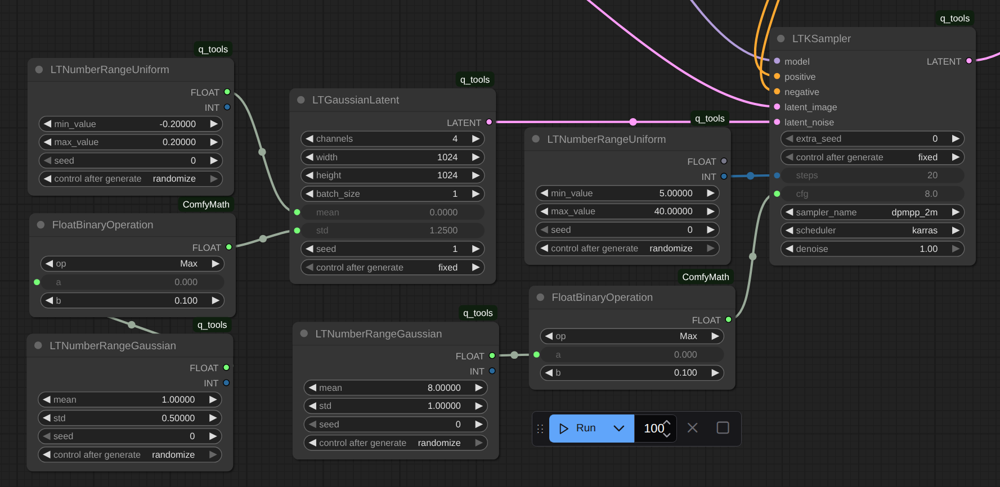 |   |

### LTFloat_Steps_0001
### LTFloat_Steps_0001
### LTFloat_Steps_0002
### LTFloat_Steps_0005
### LTFloat_Steps_001
### LTFloat_Steps_002
### LTFloat_Steps_005
### LTFloat_Steps_01
### LTFloat_Steps_02
### LTFloat_Steps_05
### LTFloat_Steps_1

These nodes are used to increment/decrement a float value by a fixed amount when scheduling multiple images.

| 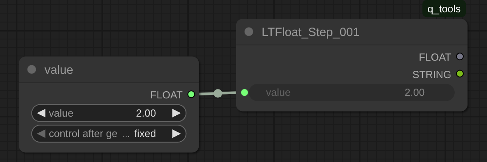 |
|------------|
| **Inputs** |
| - `value`: float |
| **Outputs** |
| - `float`: float |
| - `string`: string |

**Example:**

Generate images with fixed seed Gaussian noise, starting with σ etween 0.8 and 1.2 with 0.001 step increments:

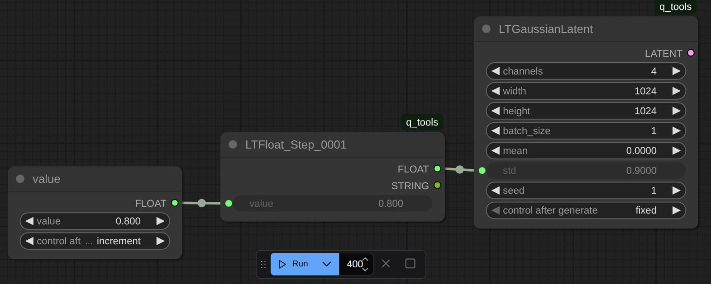

Generate images with fixed seed Gaussian noise, starting with μ between -0.22 and 0.3 with 0.001 step increments:

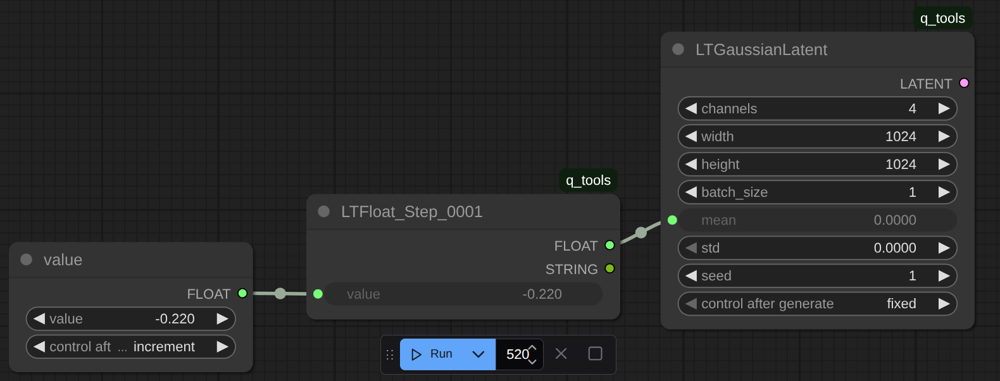

Result:
| Sweeping Standard Deviation (σ) | Sweeping Mean (μ) |
|---|---|
|  |  |
