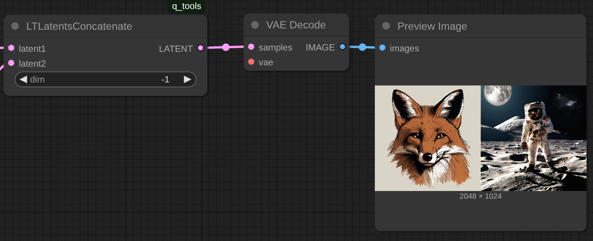

# Latent Tools for ComfyUI

A collection of nodes for manipulating latent tensors in ComfyUI. These tools provide various operations for working with latent representations in stable diffusion workflows.

## Installation

1. Clone this repository into your `ComfyUI/custom_nodes/` directory
2. Restart ComfyUI

Or use the ComfyUI extension manager.

## Available Nodes

### Latent noise generation

#### LTGaussianLatent

Generates latent tensors filled with random values from a normal (Gaussian) distribution.

|  |
|------------|
| **Inputs** |
| - `channels`: Number of channels (default: 4) |
| - `width`: Width of the latent space (will be divided by 8) |
| - `height`: Height of the latent space (will be divided by 8) |
| - `batch_size`: Number of samples to generate |
| - `mean`: Mean of the normal distribution |
| - `std`: Standard deviation of the normal distribution |
| - `seed`: Random seed |
| **Outputs** |
| - `latent`: Generated latent tensor |
|  |

#### LTUniformLatent
Generates latent tensors with values uniformly distributed between min and max.

|  |
|------------|
| **Inputs** |
| - `channels`: Number of channels (default: 4) |
| - `width`: Width of the latent space (will be divided by 8) |
| - `height`: Height of the latent space (will be divided by 8) |
| - `batch_size`: Number of samples to generate |
| - `min`: Minimum value |
| - `max`: Maximum value |
| - `seed`: Random seed |
| **Outputs** |
| - `latent`: Generated latent tensor |
|  |

### Latent Operations

#### LTBlendLatent
Blends two latent tensors using various blending modes.

|  |
|------------|
| **Inputs** |
| - `latent1`: First latent tensor |
| - `latent2`: Second latent tensor |
| - `mode`: Blending mode |
| - `ratio`: Blend ratio (0.0 to 1.0) **Only used for mode=sample or mode=interpolate** |
| - `seed`: Random seed **Only used for mode=sample** |
| **Outputs** |
| - `latent`: Blended latent tensor |

| **Blending Modes** | **Description** |
|-------------------|-----------------|
| `interpolate`     | Linear interpolation between latents |
| `add`             | Additive blending |
| `multiply`        | Multiplicative blending |
| `abs_max`         | Maximum of absolute values |
| `abs_min`         | Minimum of absolute values |
| `max`             | Element-wise maximum |
| `min`             | Element-wise minimum |
| `sample`          | Randomly sample from either latent based on ratio |

Example:
Inputs: Random Gaussian σ=1 μ=0 (top) and Random Uniform [-1, 1] (bottom)
Blend modes: interpolate (top) and sample (bottom)

#### LTLatentOp
Applies mathematical operations to a latent tensor.

|  |
|------------|
| **Inputs** |
| - `latent`: Input latent tensor |
| - `op`: Operation to apply |
| - `arg`: Argument to apply (for operations that require an argument) |
| **Outputs** |
| - `latent`: Resulting latent tensor |

| **Operation** | **Description** |
|---------------|-----------------|
| `add`         | Add a value |
| `mul`         | Multiply by a value |
| `pow`         | Raise to a power |
| `exp`         | Exponential |
| `abs`         | Absolute value |
| `clamp_bottom` | Clamp minimum value |
| `clamp_top`   | Clamp maximum value |
| `norm`        | Normalize (zero mean, unit variance) |
| `mean`        | Set mean to specified value |
| `std`         | Set standard deviation to specified value |
| `sigmoid`     | Apply sigmoid function |
| `nop`         | No operation |

Example:
Inputs: Random Gaussian σ=1 μ=0
Op: abs

#### LTLatentsConcatenate
Concatenates two latent tensors along a specified dimension.

|  |
|------------|
| **Inputs** |
| - `latent1`: First latent tensor |
| - `latent2`: Second latent tensor |
| - `dim`: Dimension to concatenate along (supports negative indexing) |
| **Outputs** |
| - `latent`: Concatenated latent tensor |

Example1:
2 images, concatenated along x axis:

Example2:
Stable Video Diffusion xt (24 frames total), concatenating
- 10 frames Gaussian noise (σ=1 μ=0)
- 4  frames Gaussian noise (σ=1.2 μ=0)
- 10 frames Gaussian noise (σ=1 μ=0)

| 10f (σ=1 μ=0) + 4f (σ=1.2 μ=0) + 10f (σ=1 μ=0) | 24f (σ=1 μ=0) |
|---|---|
|  |  |

#### LTReshapeLatent
Reshapes a latent tensor to new dimensions.

**Inputs:**
- `input`: Input latent tensor
- `strict`: If True, requires exact size match
- `dim0`-`dim3`: Target dimensions (0 = keep original size)

#### LTLatentToShape
Extracts the shape of a latent tensor.

**Outputs:**
- Returns up to 7 dimensions of the input latent shape

### Preview and Debug

#### LTPreviewLatent
Visualizes latent tensors for debugging and inspection.

{width=70%}

### Parameter Randomization

#### LTRandomRangeUniform
Generates random values from a uniform distribution.

#### LTRandomRangeGaussian
Generates random values from a Gaussian distribution.

## Usage Examples

1. **Generate and Preview Latent**
   - Use `LTGaussianLatent` to create random noise
   - Connect to `LTPreviewLatent` to visualize

2. **Blend Two Latents**
   - Generate two different latents
   - Use `LTBlendLatent` with mode="interpolate"
   - Adjust the ratio parameter to control the blend

3. **Apply Operations**
   - Load or generate a latent
   - Use `LTLatentOp` to apply transformations
   - Chain multiple operations for complex effects

## License

This project is licensed under the MIT License - see the LICENSE file for details.